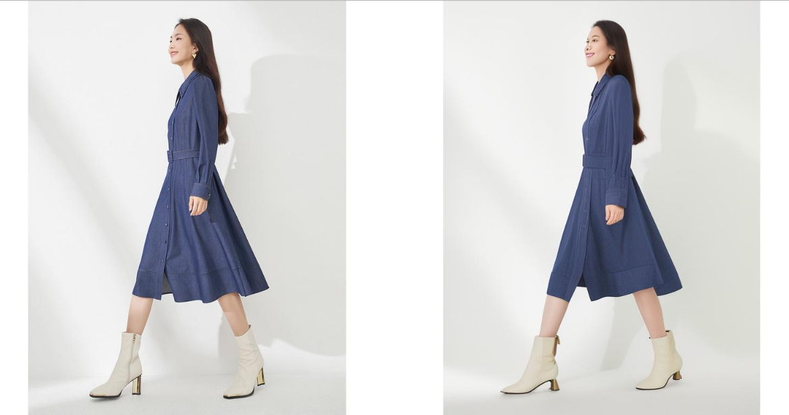

    

    <!-- visitor statistics logo 访问量统计徽标 -->
    

### Hi there 👋
- 🔭 I’m currently working on something cool.
- 🌱 I’m currently learning Everything I like.
- 💬 Ask me about anything related to Python.

You are my  visitor,Thank You! :kissing_heart: :kissing_heart:      

<!--
**greasebig/greasebig** is a ✨ _special_ ✨ repository because its `README.md` (this file) appears on your GitHub profile.

Here are some ideas to get you started:

- 🔭 I’m currently working on ...
- 🌱 I’m currently learning ...
- 👯 I’m looking to collaborate on ...
- 🤔 I’m looking for help with ...
- 💬 Ask me about ...
- 📫 How to reach me: ...
- 😄 Pronouns: ...
- ⚡ Fun fact: ...
-->

<tr><td>
📊 Github Statistics

      

</td></tr>

✨ Github Activity
    

</td></tr>

<tr><td>
</table>

### what I'm doing 😄

#### image variation train result        

#### pose driven image variation train result     

#### animate 
(the fourth colume is base model, the **fifth** colomn is **optimized model** trained by me)

Here are some ideas to get you started:

- 🔭 I’m currently working on ...
- 🌱 I’m currently learning ...
- 👯 I’m looking to collaborate on ...
- 🤔 I’m looking for help with ...
- 💬 Ask me about ...
- 📫 How to reach me: ...
- 😄 Pronouns: ...
- ⚡ Fun fact: ...

### Activity 🤔

