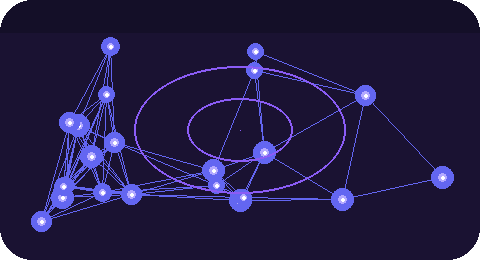

<!-- SEO: Structured metadata for search engine indexing -->
<!--
  @greasebig — AI Researcher & Engineer
  Keywords: Computer Vision, Generative AI, Video Understanding, AI Agent, Diffusion Models, arXiv, Python, Deep Learning, Foundation Models, Harness Engineering, MCP, A2A, ACP
  Site: https://greasebig.github.io
-->

<!-- Typing SVG with more keywords for SEO -->

  
  
  
  

---

  Three entry points for my work: portfolio, daily research signals, and agent ecosystem indexing.

  
  &nbsp;
  
  &nbsp;
  

  <a href="https://greasebig.github.io"><b>🏠 Homepage</b></a>
  &nbsp;&nbsp;•&nbsp;&nbsp;
  <a href="https://greasebig.github.io/daily-video-papers/"><b>📚 Papers Hub</b></a>
  &nbsp;&nbsp;•&nbsp;&nbsp;
  <a href="https://greasebig.github.io/awesome-agent-everything/"><b>🤖 Agent Index</b></a>

---

### 👋 About

- 🔭 Researching **computer vision, generative AI, video understanding & AI agent engineering**
- 🌱 Exploring **foundation models, diffusion models, Harness Engineering, MCP/A2A/ACP protocols**
- 💬 Ask me about **Python, PyTorch, video editing, arXiv paper tracking, Agent infrastructure**
- ✍️ Author of [Claw Runtime & Agent Ecosystem 2026](https://greasebig.github.io/articles/claw-runtime.html), [Harness Engineering](https://greasebig.github.io/articles/harness-engineering.html), [Harness POC](https://greasebig.github.io/articles/harness-poc.html), and [MCP Deep Dive](https://greasebig.github.io/articles/mcp-deep-dive.html)

---

### 🛠️ Projects

| Project | Description | Topics |
|---|---|---|
| 📰 **[Daily Video Papers](https://github.com/greasebig/daily-video-papers)** | Automated arXiv paper tracking hub for Video, World Models, Agents & Tone/Color research | `arXiv` `video` `agents` `automation` |
| 🤖 **[Awesome Agent Everything](https://github.com/greasebig/awesome-agent-everything)** | Meta-index of AI Agent repositories — automated classification & tagging | `agent` `MCP` `A2A` `awesome-list` |
| 🔧 **[harness-poc](https://github.com/greasebig/harness-poc)** | Minimal Agent Harness POC — Agent = Model + Harness (~300 lines Python) | `agent` `harness` `LLM` `Python` |
| 👗 **[cloth-match](https://github.com/greasebig/cloth-match-main)** | Efficient cloth matching system with deep visual features | `CV` `retrieval` `fashion` |
| 🎯 **[multimodal](https://github.com/greasebig/multimodal)** | Multimodal learning research | `multimodal` `vision` `language` |
| 🚁 **[uav-dispatch](https://github.com/greasebig/uav-dispatch-platform)** | UAV dispatch and management platform | `UAV` `dispatch` `platform` |

📖 Explored / Tried (fork repos)

- [VideoCoF](https://github.com/greasebig/VideoCoF) — CVPR 2026 Highlight: Unified Video Editing with Temporal Reasoner
- [LiveMoments](https://github.com/greasebig/LiveMoments) — ICLR 2026: Key Photo Restoration in Live Photos
- [DynVFX](https://github.com/greasebig/dynvfx) — SIGGRAPH Asia 2025: Augmenting Real Videos with Dynamic Content
- [ReCo](https://github.com/greasebig/ReCo) — CVPR: Region-Constrained In-Context Generation
- [CVPR 2023 Challenge](https://github.com/greasebig/CVPR-2023-1st-foundation-model-challenge-Track-2-1th-solution) — CVPR 2023 Foundation Model Challenge, Track 2 solution
- [claude-code](https://github.com/greasebig/claude-code) — Claude Code runnable build (Bun + TypeScript)
- [MimicMotion_train](https://github.com/greasebig/MimicMotion_train) — MimicMotion training
- [mmrotate](https://github.com/greasebig/mmrotate) — OpenMMLab Rotated Object Detection

---

### 🎨 What I'm Working On

#### Image Variation — Training Result *(Completed: Oct 2024)*

  

#### Animation *(Completed: Nov 2024)*

*The fourth column is the base model, the **fifth** column is the **optimized model** trained by me.*

  

---

### 🎬 Site Previews

  
  &nbsp;
  
  &nbsp;
  

---

<!-- Skills / Tech Stack badges -->

---

### 📊 GitHub Stats & Activity

<!-- Snake animation contribution graph (requires output branch) -->
<picture>
  <source media="(prefers-color-scheme: dark)" srcset="https://raw.githubusercontent.com/greasebig/greasebig/output/github-snake-dark.svg" />
  <source media="(prefers-color-scheme: light)" srcset="https://raw.githubusercontent.com/greasebig/greasebig/output/github-snake.svg" />
  
</picture>

  

  

  You are my  — thank you! 😊

---

<!-- Cool footer effects -->

<!-- Quote -->

 

<!-- Emojigram decoration -->

