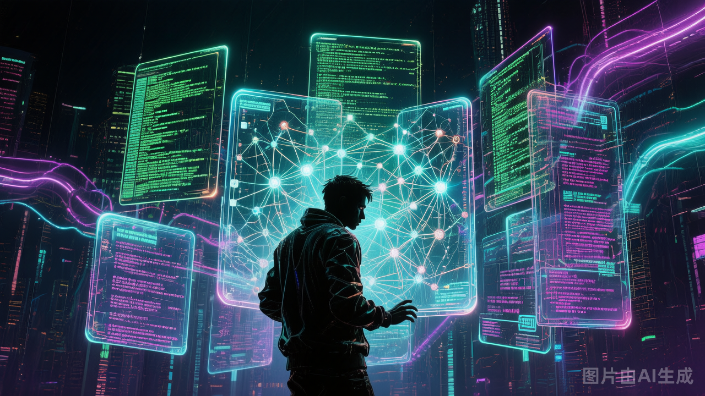

<!-- ⚡ SIGNAL INTERCEPTED — greasebig profile README ⚡ -->


<p align="center">
  
</p>

<p align="center">
  
  
  
  
</p>

---

<!-- 🖥️ TERMINAL-STYLE INTRO -->
<div align="center">

```
╔══════════════════════════════════════════════════════╗
║  > whoami                                           ║
║  greasebig — CV · Generative AI · Video             ║
║                                                     ║
║  > cat mission.txt                                  ║
║  Making pixels think, frames remember,             ║
║  and agents actually work.                          ║
║                                                     ║
║  > ls achievements/                                 ║
║  CVPR'23 Champion  CVPR'26 Highlight  ICLR'26      ║
╚══════════════════════════════════════════════════════╝
```

</div>

---

<!-- 🌐 SIGNAL MAP — Websites as radar blips -->
### 📡 Signal Map

```
  ┌─ 🏠 Home Base ──────────── greasebig.github.io
  │
  ├── 📚 Papers Intercepted ── daily-video-papers (arXiv daily tracker)
  │
  └── 🎨 Tone & Color ──────── cinematic color theory papers
```

| Signal | Frequency | Description |
|--------|-----------|-------------|
| 🏠 **[Home Base](https://greasebig.github.io)** | Always on | Personal homepage — projects, articles, and links |
| 📚 **[Papers Hub](https://greasebig.github.io/daily-video-papers/)** | Daily | arXiv paper tracker — Video, World Models, Agents & Tone/Color |
| 🎨 **[Tone & Color](https://greasebig.github.io/daily-video-papers/tone-color/index.html)** | Weekly | Color grading, tone mapping, cinematic color theory |

---

<!-- 🛠️ PROJECTS — as "deployed systems" -->
### 🚀 Deployed Systems

```
  SYSTEM          STATUS      DESCRIPTION
  ──────────────  ──────────  ────────────────────────────────────────────
  daily-video     ● ACTIVE    arXiv paper tracking (Video/Agents/Tone&Color)
  harness-poc     ● ACTIVE    Agent = Model + Harness (~300 lines POC)
  agent-all       ● ACTIVE    Meta-index of 500+ awesome-agent repos
  cloth-match     ○ STANDBY   Efficient cloth matching
  multimodal      ○ STANDBY   Multimodal learning
  uav-dispatch    ○ STANDBY   UAV dispatch platform
  leetcode        ◌ TRAINING  Algorithm practice
```

| System | Status | Description |
|--------|--------|-------------|
| 📰 **[daily-video-papers](https://github.com/greasebig/daily-video-papers)** | `● ACTIVE` | Automated arXiv paper tracking hub for Video, World Models, Agents & Tone/Color |
| 🔧 **[harness-poc](https://github.com/greasebig/harness-poc)** | `● ACTIVE` | Minimal Agent Harness POC — Agent = Model + Harness (~300 lines Python) |
| 🤖 **[awesome-agent-everything](https://github.com/greasebig/awesome-agent-everything)** | `● ACTIVE` | Meta-index of ALL awesome agent repos on GitHub — Auto-updated every 3 days |
| 👗 **[cloth-match](https://github.com/greasebig/cloth-match-main)** | `○ STANDBY` | Efficient cloth matching system |
| 🎯 **[multimodal](https://github.com/greasebig/multimodal)** | `○ STANDBY` | Multimodal learning |
| 🚁 **[uav-dispatch](https://github.com/greasebig/uav-dispatch-platform)** | `○ STANDBY` | UAV dispatch platform |
| 🧠 **[leetcode](https://github.com/greasebig/leetcode)** | `◌ TRAINING` | Algorithm practice |

<details>
<summary>📡 Intercepted Signals (explored / tried repos)</summary>
<br/>

> *These signals were intercepted during exploration — not my original transmissions.*

| Signal | Origin | Description |
|--------|--------|-------------|
| [VideoCoF](https://github.com/greasebig/VideoCoF) | CVPR 2026 Highlight | Unified Video Editing with Temporal Reasoner |
| [LiveMoments](https://github.com/greasebig/LiveMoments) | ICLR 2026 | Key Photo Restoration in Live Photos |
| [DynVFX](https://github.com/greasebig/dynvfx) | SIGGRAPH Asia 2025 | Augmenting Real Videos with Dynamic Content |
| [ReCo](https://github.com/greasebig/ReCo) | CVPR | Region-Constrained In-Context Generation |
| [claude-code](https://github.com/greasebig/claude-code) | Anthropic | Claude Code runnable build (Bun + TypeScript) |
| [MimicMotion_train](https://github.com/greasebig/MimicMotion_train) | — | MimicMotion training |
| [mmrotate](https://github.com/greasebig/mmrotate) | OpenMMLab | Rotated Object Detection |

</details>

---

<!-- 🎨 VISION LAB — visual results -->
### 🎨 Vision Lab

<p align="center">
  
</p>

#### ▸ Image Variation — Training Result *(Oct 2024)*

<p align="center">
  
</p>

#### ▸ Animation — Optimized Model *(Nov 2024)*

*Column ④ = base model · Column ⑤ = **my optimized model***

<p align="center">
  
</p>

---

<!-- 📊 TELEMETRY -->
### 📊 Telemetry

<p align="center">
  
  
</p>

<p align="center">
  
</p>

---

<!-- 🔗 CONTACT & FOOTER -->
### 🔗 Connect

<p align="center">
  <a href="https://greasebig.github.io"></a>
  <a href="https://github.com/greasebig"></a>
</p>

---


<p align="center">
  <sub>You are visitor # — signal acknowledged 📡</sub>
</p>


