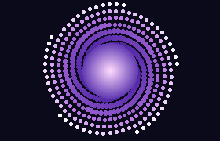
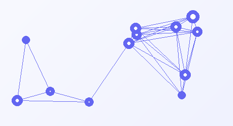

  
  
  

---

  <a href="https://greasebig.github.io"><b>🏠 Homepage</b></a> · <a href="https://greasebig.github.io/daily-video-papers/"><b>📚 Papers Hub</b></a> · <a href="https://greasebig.github.io/awesome-agent-everything/"><b>🤖 Agent Index</b></a>

---

### 👋 About

- 🔭 Working on **computer vision, generative AI, and video understanding**
- 🌱 Always learning — from foundation models to agent engineering
- 💬 Ask me about **Python, diffusion models, video editing, arXiv paper tracking**

---

### 🛠️ Projects

| Project | Description |
|---|---|
| 📰 **[Daily Video Papers](https://github.com/greasebig/daily-video-papers)** | Automated arXiv paper tracking hub for Video, World Models, Agents & Tone/Color research |
| 🔧 **[harness-poc](https://github.com/greasebig/harness-poc)** | Minimal Agent Harness POC — Agent = Model + Harness (~300 lines Python) |
| 👗 **[cloth-match](https://github.com/greasebig/cloth-match-main)** | Efficient cloth matching system |
| 🎯 **[multimodal](https://github.com/greasebig/multimodal)** | Multimodal learning |
| 🚁 **[uav-dispatch](https://github.com/greasebig/uav-dispatch-platform)** | UAV dispatch platform |

📖 Explored / Tried (fork repos)

- [VideoCoF](https://github.com/greasebig/VideoCoF) — CVPR 2026 Highlight: Unified Video Editing with Temporal Reasoner
- [LiveMoments](https://github.com/greasebig/LiveMoments) — ICLR 2026: Key Photo Restoration in Live Photos
- [DynVFX](https://github.com/greasebig/dynvfx) — SIGGRAPH Asia 2025: Augmenting Real Videos with Dynamic Content
- [ReCo](https://github.com/greasebig/ReCo) — CVPR: Region-Constrained In-Context Generation
- [CVPR 2023 Challenge](https://github.com/greasebig/CVPR-2023-1st-foundation-model-challenge-Track-2-1th-solution) — CVPR 2023 Foundation Model Challenge, Track 2 solution
- [claude-code](https://github.com/greasebig/claude-code) — Claude Code runnable build (Bun + TypeScript)
- [MimicMotion_train](https://github.com/greasebig/MimicMotion_train) — MimicMotion training
- [mmrotate](https://github.com/greasebig/mmrotate) — OpenMMLab Rotated Object Detection

---

### 📊 GitHub Stats

  
  

  

---

### 🎨 What I'm Working On

#### Image Variation — Training Result *(Completed: Oct 2024)*

  

#### Animation *(Completed: Nov 2024)*

*The fourth column is the base model, the **fifth** column is the **optimized model** trained by me.*

  

---

### 📈 Repository Activity

  You are my  visitor — thank you! 😊

---

